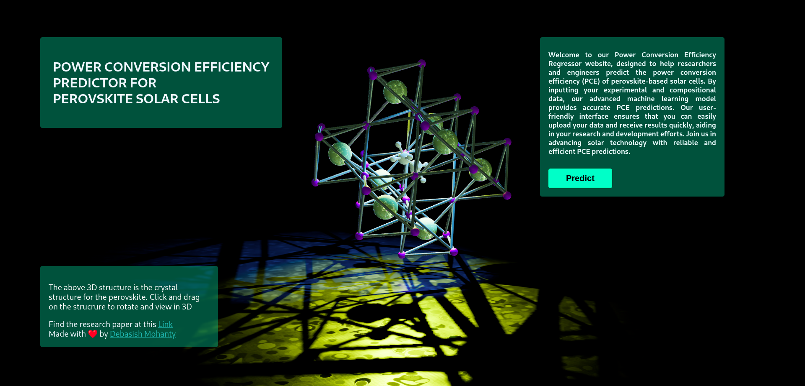
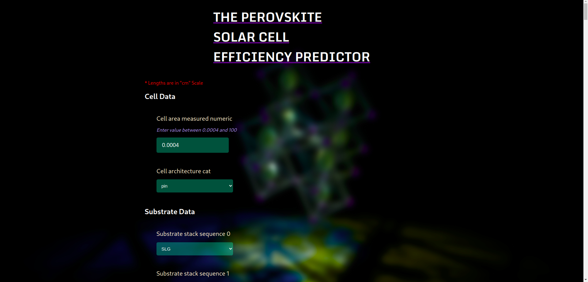

# Power Conversion Efficiency (PCE) Prediction for Perovskite Solar Cells (PSCs)

Welcome to the PCE prediction project for Perovskite Solar Cells (PSCs)! This project aims to provide a tool for predicting the Power Conversion Efficiency (PCE) of PSCs based on experimental and compositional data. Utilizing machine learning models, this tool can help researchers and engineers in the field of solar energy to optimize their solar cell designs.

## Table of Contents

- [Introduction](#introduction)
- [Features](#features)
- [Installation](#installation)
  - [Prerequisites](#prerequisites)
  - [Using Docker](#using-docker)
- [Usage](#usage)
- [Sample Deployment](#sample-deployment)
- [Citation](#citation)
- [License](#license)

## Introduction

Perovskite Solar Cells (PSCs) have shown great potential in recent years due to their high efficiency and relatively low production cost. Predicting the Power Conversion Efficiency (PCE) accurately is crucial for the development and optimization of these solar cells. This project leverages advanced machine learning techniques to provide accurate PCE predictions based on various input parameters.

## Features

- Predict PCE based on experimental and compositional data
- User-friendly web interface built with React
- Fast and efficient backend powered by FastAPI
- Dockerized setup for easy deployment

## Installation

### Prerequisites

- Docker
- Docker Compose

### Using Docker

Follow the steps below to set up and run the project using Docker:

1. **Clone the repository:**

    ```sh
    git clone https://github.com/yourusername/pce-prediction-pscs.git
    cd pce-prediction-pscs
    ```

2. **Build and run the Docker containers:**

    ```sh
    docker-compose up --build
    ```

3. **Access the application:**

    - React frontend: `http://localhost:6969`
    - FastAPI backend: `http://localhost:8000`

## Usage

Once the application is up and running, you can navigate to the React frontend URL (`http://localhost:6969`) to access the web interface. Here, you can input the experimental and compositional data required for the PCE prediction and get the results instantly.

## Sample Deployment

Here's a screenshot of the application in action:

Home


Deployment


## Citation

If you use this project in your research, please cite the following paper:

```@article{mohanty2023comprehensive,
  title={Comprehensive Machine Learning Pipeline for Prediction of Power Conversion Efficiency in Perovskite Solar Cells},
  author={Mohanty, Debasish and Palai, Akshaya Kumar},
  journal={Advanced Theory and Simulations},
  volume={6},
  number={12},
  pages={2300309},
  year={2023},
  publisher={Wiley Online Library}
}```

